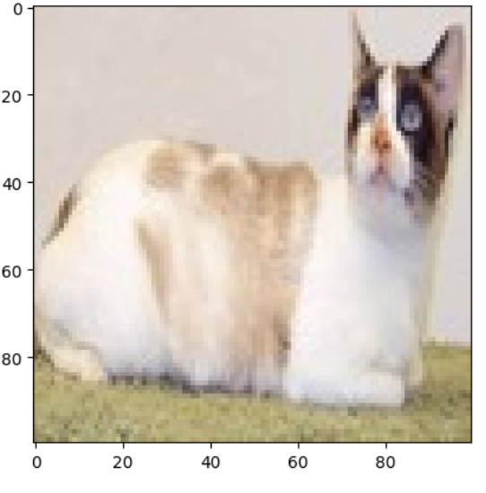
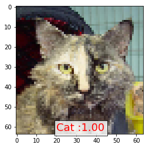

# Dog vs Cat Convolution Neural Network Classifier
         

### Problem statement :

In this Section we are implementing Convolution Neural Network(CNN) Classifier for Classifying dog and cat images. The Total number of images available for training is 4,000 and final testing is done on seperate 1000 images.
#### Note:This problem statement and dataset is taken from [this](https://www.kaggle.com/c/dogs-vs-cats) Kaggle competition.

### Dependencies
* Jupyter notebook
* Tensorflow 1.10
* Python 3.6
* Matplotlib
* Seaborn
* Scikit-Learn
* Pandas
* Numpy

Install dependencies in system using (pip install 'dependecies name')
we are using jupyter notebook

#### Test Train Split
Image training set contain 12500 images for each category. I split those into 80% train and 20% means test Split each class images into 10,000 for train and 2,500 for test. 

### Architecture


```python
import numpy as np
import random
import matplotlib.pyplot as plt
from tensorflow.keras.models import Sequential
from tensorflow.keras.layers import Conv2D,MaxPooling2D,Dense,Flatten
```
### Load Dataset

```python
X_train = np.loadtxt('input.csv',delimiter = ',')
Y_train = np.loadtxt('labels.csv',delimiter = ',')

X_test = np.loadtxt('input_test.csv',delimiter = ',')
Y_test = np.loadtxt('labels_test.csv',delimiter = ',')
```

### Reshape of Dataset

```python
X_train = X_train.reshape(len(X_train),100,100,3)
Y_train = Y_train.reshape(len(Y_train),1)

X_test = X_test.reshape(len(X_test),100,100,3)
Y_test = Y_test.reshape(len(Y_test),1)

X_train = X_train/255.0
X_test = X_test/255.0
```

```python
X_train[1,:]
```

```
array([[[0.51372549, 0.50196078, 0.52941176],
        [0.62745098, 0.61568627, 0.64313725],
        [0.77647059, 0.75294118, 0.8       ],
        ...,
        [0.98039216, 0.97647059, 0.96862745],
        [1.        , 1.        , 0.99215686],
        [0.98039216, 0.97647059, 0.96078431]],

       [[0.54901961, 0.5372549 , 0.56470588],
        [0.49803922, 0.48627451, 0.51372549],
        [0.47058824, 0.44705882, 0.48627451],
        ...,
        [0.98431373, 0.99215686, 0.98823529],
        [0.99607843, 1.        , 0.99215686],
        [0.99607843, 1.        , 0.98431373]],

       [[0.8       , 0.79215686, 0.81176471],
        [0.73333333, 0.7254902 , 0.74509804],
        [0.57647059, 0.55686275, 0.58039216],
        ...,
        [0.97647059, 1.        , 1.        ],
        [0.93333333, 0.96862745, 0.94901961],
        [0.90980392, 0.94509804, 0.9254902 ]],

       ...,

       [[0.68235294, 0.71372549, 0.76470588],
        [0.6745098 , 0.70588235, 0.75686275],
        [0.69803922, 0.72941176, 0.77254902],
        ...,
        [0.34117647, 0.44705882, 0.38039216],
        [0.29411765, 0.38823529, 0.3254902 ],
        [0.31372549, 0.41176471, 0.3372549 ]],

       [[0.65098039, 0.67843137, 0.74117647],
        [0.64313725, 0.6745098 , 0.7254902 ],
        [0.6745098 , 0.70588235, 0.75686275],
        ...,
        [0.30588235, 0.41568627, 0.32941176],
        [0.28235294, 0.38039216, 0.29803922],
        [0.30196078, 0.4       , 0.31764706]],

       [[0.67843137, 0.70588235, 0.76862745],
        [0.6745098 , 0.70196078, 0.76470588],
        [0.68235294, 0.71372549, 0.76470588],
        ...,
        [0.24705882, 0.35686275, 0.27058824],
        [0.24313725, 0.34117647, 0.25490196],
        [0.27843137, 0.37647059, 0.29019608]]])
```

Shape of Dataset

```python
print("Shape of X_train:", X_train.shape)
print("Shape of Y_train:", Y_train.shape)
print("Shape of X_test:", X_test.shape)
print("Shape of Y_test:", Y_test.shape)
```

```
Shape of X_train: (2000, 100, 100, 3)
Shape of Y_train: (2000, 1)
Shape of X_test: (400, 100, 100, 3)
Shape of Y_test: (400, 1)
```
## Random image generation

```python
idx = random.randint(0, len(X_train))
plt.imshow(X_train[idx, :])
plt.show()
```


.


Network Parameter:
* Rectifier Linear Unit 
* Adam optimizer
* Sigmoid on Final output
* Binary CrossEntropy loss


```python
model = Sequential([
    Conv2D(32, (3,3), activation='relu', input_shape=(100,100,3), name='conv2d_4'),
    MaxPooling2D((2,2), name='max_pooling2d_4'),
    
    Conv2D(32, (3,3), activation='relu', name='conv2d_5'),
    MaxPooling2D((2,2), name='max_pooling2d_5'),
    
    Flatten(name='flatten_2'),
    Dense(64, activation='relu', name='dense_4'),
    Dense(1, activation='sigmoid', name='dense_5')
])
```

```python
model.compile(loss = 'binary_crossentropy', optimizer = 'adam',metrics = ['accuracy'])
```

## Data Augmentation
Using some Data Augmentation techniques for more data and Better results.
* Shearing of images
* Random zoom
* Horizontal flips


```python
train_datagen = ImageDataGenerator(
    shear_range=0.2,   # Shearing effect
    zoom_range=0.2,    # Random zoom
    horizontal_flip=True  # Flip images horizontally
)

train_generator = train_datagen.flow(X_train, Y_train, batch_size=32)
```
## Training the Model
```python
history = model.fit(X_train, Y_train,epochs = 5,batch_size = 64, validation_data=(X_test, Y_test))
```

```
Epoch 1/5
32/32 ━━━━━━━━━━━━━━━━━━━━ 8s 199ms/step - accuracy: 0.4848 - loss: 0.8049 - val_accuracy: 0.5375 - val_loss: 0.6918
Epoch 2/5
32/32 ━━━━━━━━━━━━━━━━━━━━ 6s 179ms/step - accuracy: 0.5394 - loss: 0.6884 - val_accuracy: 0.6025 - val_loss: 0.6615
Epoch 3/5
32/32 ━━━━━━━━━━━━━━━━━━━━ 5s 166ms/step - accuracy: 0.6184 - loss: 0.6587 - val_accuracy: 0.6900 - val_loss: 0.6465
Epoch 4/5
32/32 ━━━━━━━━━━━━━━━━━━━━ 6s 183ms/step - accuracy: 0.7057 - loss: 0.6033 - val_accuracy: 0.7050 - val_loss: 0.5902
Epoch 5/5
32/32 ━━━━━━━━━━━━━━━━━━━━ 6s 182ms/step - accuracy: 0.7404 - loss: 0.5317 - val_accuracy: 0.7050 - val_loss: 0.5666
```

```python
model.evaluate(X_test,Y_test)
```

```
13/13 ━━━━━━━━━━━━━━━━━━━━ 0s 25ms/step - accuracy: 0.6669 - loss: 0.6093
[0.566556990146637, 0.7049999833106995]
```
## Training and Validation Accuracy

```python
plt.plot(history.history['accuracy'], label='Train Accuracy')
plt.plot(history.history['val_accuracy'], label='Validation Accuracy')
plt.xlabel('Epochs')
plt.ylabel('Accuracy')
plt.title('Training & Validation Accuracy')
plt.legend()
plt.show()
```


image


`

### Prediction of Image


```python
idx2 = random.randint(0, len(Y_test))
plt.imshow(X_test[idx2, :])
plt.show()

y_pred = model.predict(X_test[idx2, :].reshape(1,100,100,3))
y_pred = y_pred >0.5

if(y_pred == 0):
    pred = 'dog'
else:
    pred = 'cat'
print('our model recognize it as',pred)
```





### Model Accuracy

```python
%%capture
# Model Accuracy
x1 = classifier.evaluate_generator(train_set)
x2 = classifier.evaluate_generator(test_set)
```


```python
print('Training Accuracy  : %1.2f%%     Training loss  : %1.6f'%(x1[1]*100,x1[0]))
print('Validation Accuracy: %1.2f%%     Validation loss: %1.6f'%(x2[1]*100,x2[0]))
```

    Training Accuracy  : 99.96%     Training loss  : 0.002454
    Validation Accuracy: 97.56%     Validation loss: 0.102678


### Conclusion
The Architecture and parameter used in this network are capable of producing accuracy of **97.56%** on Validation Data which is pretty good. It is possible to Achieve more accuracy on this dataset using deeper network and fine tuning of network parameters for training. You can download this trained model from resource directory and Play with it. 
